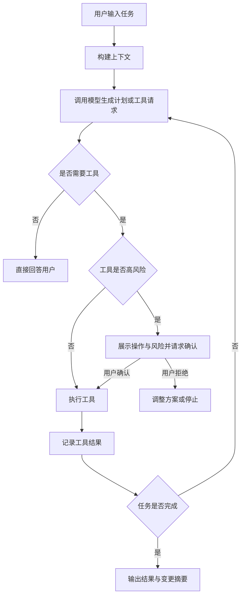
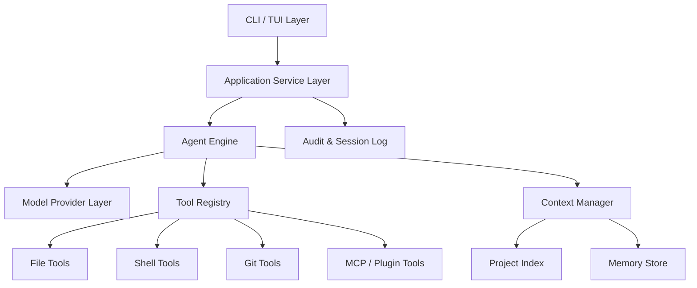

### **建议以“洁净室重实现”方式做 Python 版，而不是复刻泄露源码：目标是实现一个 Claude Code-like 的 Python 智能编程 CLI，包括交互式 TUI、非交互模式、代码读写工具、命令系统、项目记忆、MCP/插件扩展、代理与模型配置等能力。**

下面是一份可直接作为立项文档使用的《Python 版 Claude Code-like 项目开发功能规划计划书》。我会基于你给的 GitHub 项目页面中公开 README 描述的功能范围来抽象产品能力，但不建议、也不应依赖或复制其中声称来自泄露来源的实现细节。该仓库 README 展示的能力包括交互式 TUI、`-p` 非交互模式、模型指定、API Key/登录态、第三方代理、环境变量配置、约 40 类工具、斜杠命令、MCP、LSP、IDE 集成、多 Agent 协调、插件和持久记忆等，这些可以作为“功能目标参考”，但 Python 版应采用独立设计、独立代码、独立测试的方式实现。 [GitHub](https://github.com/funisgoou/start-claude-code)

---

## **Python 版智能编程 CLI 项目开发功能规划计划书**

### **一、项目背景**

当前开发者越来越依赖 AI 辅助完成代码阅读、修改、调试、重构、测试生成、提交说明生成和项目理解等任务。传统聊天式 AI 工具虽然可以回答代码问题，但在真实工程场景中仍存在几个明显不足：无法直接理解本地项目结构，无法安全地读取和修改文件，无法持续记忆项目上下文，无法在终端中形成自然的开发工作流，也缺少可扩展的工具调用机制。

本项目计划使用 Python 重新实现一个面向开发者的智能编程命令行工具。它不是对任何已有闭源或泄露源码的复制，而是基于公开可观察的产品能力，采用洁净室开发方式，设计一个具备交互式终端界面、非交互脚本模式、代码工具调用、项目上下文管理、插件扩展和多模型接入能力的 Python 版智能编码助手。

项目暂定名称可为 `PyCodeAgent`、`OpenCodePilot` 或 `CodeMate CLI`。如果希望突出兼容性，也可以命名为 `py-claude-code-like`，但正式产品建议避免使用可能引起商标混淆的名称。

---

### **二、项目目标**

本项目的核心目标是实现一个 Python 编写的本地智能编程 Agent CLI，让开发者可以在终端中通过自然语言完成代码理解、文件修改、命令执行、测试运行、Git 操作和项目级任务规划。

第一阶段目标是完成可用的 MVP：支持命令行入口、API Key 配置、项目扫描、文件读取、文件编辑、Shell 命令执行、非交互问答、基础交互式会话和安全权限确认。第二阶段增强 TUI、上下文压缩、工具调用编排、斜杠命令、Git 辅助、项目记忆和 MCP 协议。第三阶段进一步扩展到插件系统、IDE 通信、多 Agent 协作、LSP 集成、代码索引和长期任务自动化。

项目最终应具备以下特征：安装简单、跨平台、可配置、多模型、工具调用安全、代码修改可追踪、适合真实工程项目，并能作为 Python 生态中的智能编程 CLI 基础框架。

---

### **三、合规与实现原则**

本项目必须采用洁净室重实现原则。开发过程中不得复制、反编译、改写或依赖任何非授权源码，也不应复刻内部私有接口、私有资源或非公开实现。可以参考公开 README、公开命令行为、公开协议和通用开发者需求来定义功能，但所有架构、代码、测试和文档都应由团队独立完成。

在身份认证方面，不建议实现“复用其他官方工具登录态”的能力，除非该登录态的使用方式有明确授权和公开协议。MVP 阶段建议仅支持标准 API Key、本地配置文件和环境变量。后续如需支持 OAuth，也应使用公开、合规的授权流程，而不是读取其他工具的本地凭据。

在工具执行方面，所有高风险操作必须默认要求用户确认，包括文件删除、大规模改写、执行 Shell 命令、安装依赖、网络请求、Git push、权限提升命令等。项目应内置审计日志，记录模型建议、工具调用、文件变更和用户确认结果，便于回滚和问题追踪。

---

## **四、产品定位**

本项目定位为“面向开发者的本地 AI 编程 Agent”。它不是普通聊天机器人，也不是简单的代码补全插件，而是一个可以在终端中理解项目、规划任务、调用工具并协助完成代码变更的开发助手。

典型用户包括后端工程师、前端工程师、DevOps 工程师、数据工程师、开源项目维护者和技术团队内部平台开发者。核心使用场景包括阅读陌生项目、解释代码逻辑、生成测试、定位 Bug、执行重构、批量修改文件、生成提交说明、代码审查、脚本自动化和文档生成。

---

## **五、核心功能规划**

### **1. 命令行入口与运行模式**

Python 版工具应首先提供稳定的 CLI 入口，例如：

```bash
pycode
pycode chat
pycode -p "explain this project"
pycode --model xxx
pycode --config
```

运行模式分为交互式模式和非交互模式。交互式模式适合开发者在终端中持续对话，工具会维护当前项目上下文、会话历史和任务状态。非交互模式适合脚本、CI、管道输入和自动化场景，例如：

```bash
cat error.log | pycode -p "分析这个报错并给出修复建议"
pycode -p "为当前项目生成 README"
pycode -p "检查最近一次 git diff 中的问题"
```

非交互模式应支持标准输入、命令参数、JSON 输出和退出码，这样才能方便集成到 CI/CD、Git hooks 和自动化脚本中。

---

### **2. 配置系统**

配置系统需要同时支持环境变量、用户级配置文件、项目级配置文件和命令行参数。优先级建议为：命令行参数最高，其次是项目配置，然后是用户配置，最后是环境变量默认值。

建议支持的配置包括模型名称、API Base URL、API Key、请求超时时间、最大上下文长度、是否启用流式输出、是否允许执行命令、是否允许自动编辑文件、默认工作目录、代理配置、日志级别和安全策略。

配置文件可使用 TOML 或 YAML，例如：

```toml
[model]
provider = "compatible_api"
name = "default-coding-model"
base_url = "https://api.example.com"
timeout = 120

[security]
allow_shell = true
require_confirm_for_shell = true
require_confirm_for_file_write = true

[context]
max_files = 200
max_tokens = 120000
enable_project_memory = true
```

Python 实现中建议使用 `pydantic-settings` 或 `dynaconf` 管理配置，同时提供 `pycode config set`、`pycode config get`、`pycode config list` 等命令。

---

### **3. 模型接入层**

模型接入层应设计为可插拔 Provider 架构，不要把项目绑定到单一模型或单一 API。建议定义统一的 `LLMProvider` 抽象接口，屏蔽不同模型服务的请求格式差异。

核心接口包括普通聊天、流式聊天、工具调用、JSON 模式、上下文压缩和重试机制。为了适配不同 API，内部可以定义统一消息格式：

```python
class Message(BaseModel):
    role: Literal["system", "user", "assistant", "tool"]
    content: str | list[ContentBlock]
    tool_call_id: str | None = None
```

第一阶段可以支持一种 OpenAI-compatible 或自定义兼容接口，后续再扩展多个 Provider。模型层需要内置错误处理，包括认证失败、限流、超时、上下文超长、网络错误和工具调用格式错误。

---

### **4. 项目上下文管理**

智能编程 CLI 的关键能力不是单轮问答，而是理解本地项目。项目上下文管理模块需要负责扫描项目结构、识别语言和框架、读取关键文件、忽略无关目录、构建文件摘要和动态选择上下文。

默认应遵循 `.gitignore`，并额外忽略 `.git`、`node_modules`、`.venv`、`dist`、`build`、`__pycache__`、大型二进制文件、日志文件和密钥文件。项目首次进入时，可以生成一个轻量项目画像，包括语言栈、包管理器、入口文件、测试框架、构建命令、目录结构和 README 摘要。

上下文选择策略应分为三层。第一层是显式上下文，也就是用户提到的文件和路径。第二层是检索上下文，通过关键词、符号、文件名、ripgrep 或向量检索找出相关文件。第三层是项目记忆，包括用户偏好、架构说明、常用命令和历史任务结论。

---

### **5. 文件工具系统**

文件工具是本项目的核心。第一阶段应实现以下工具：

| 工具名称 | 功能 | 风险等级 | 是否需要确认 |
|---|---|---:|---|
| `read_file` | 读取文件内容 | 低 | 否 |
| `list_dir` | 查看目录结构 | 低 | 否 |
| `search_text` | 全项目文本搜索 | 低 | 否 |
| `write_file` | 写入或覆盖文件 | 高 | 是 |
| `edit_file` | 基于 diff 修改文件 | 高 | 是 |

文件编辑不建议直接让模型输出完整文件覆盖，除非文件很小。更稳妥的方式是让模型生成结构化 patch，然后由本地 patch 引擎应用。每次修改前应展示 diff，让用户确认。修改后保存变更记录，支持撤销最近一次工具变更。

建议实现 `PatchManager`，负责解析 unified diff、校验上下文、检测冲突、应用变更和生成回滚补丁。这样可以显著降低模型误改文件的风险。

---

### **6. Shell 命令执行工具**

Shell 工具用于运行测试、安装依赖、查看 Git 状态、执行 lint、启动构建等。由于风险较高，必须内置权限控制。

默认策略建议如下：读取类命令如 `pwd`、`ls`、`git status` 可以低风险执行；修改类命令如 `pip install`、`npm install`、`pytest --update-snapshot` 需要确认；危险命令如 `rm -rf`、`sudo`、格式化磁盘、修改系统目录、上传密钥等必须阻止或强制二次确认。

Shell 执行模块需要支持超时、工作目录、环境变量、输出截断、流式输出和退出码捕获。工具结果应返回结构化数据，包括 stdout、stderr、exit_code、duration 和是否超时。

---

### **7. Agent 任务循环**

项目的智能核心是 Agent Loop，即模型根据用户目标进行思考、选择工具、观察结果、继续规划，直到完成任务或请求用户确认。

推荐实现如下流程：



Agent Loop 必须设置最大轮数、最大工具调用次数、最大费用或 token 限制，防止无限循环。每轮工具调用都应写入会话日志，便于调试和审计。

---

### **8. 交互式 TUI**

交互式 TUI 是提升体验的重要模块，但不建议在 MVP 阶段过度复杂化。Python 生态中推荐使用 `Textual` 或 `prompt_toolkit`。如果希望快速实现类终端聊天体验，可以先用 `prompt_toolkit`；如果希望实现复杂布局、侧边栏、状态栏和实时面板，可以用 `Textual`。

TUI 应包括输入区、消息区、工具调用状态区、diff 预览区和底部状态栏。状态栏展示当前模型、工作目录、权限模式、上下文大小和会话状态。用户可以通过快捷键中断生成、接受修改、拒绝修改、查看 diff、清屏和切换模式。

MVP 阶段可以先实现简洁版：

```bash
You > 修复当前项目里的测试失败
Agent > 我会先查看测试配置和最近的错误信息。
Tool > run_shell: pytest
Agent > 发现 tests/test_x.py 失败，原因是...
Diff > 展示拟修改内容
Confirm? [y/N]
```

后续再升级为完整 TUI。

---

### **9. 非交互模式**

非交互模式应作为一等能力，而不是交互模式的附属功能。它适合流水线、批处理和脚本调用。

建议支持以下能力：

```bash
pycode -p "解释这个错误" < error.log
pycode -p "根据 git diff 写 commit message" --no-tools
pycode -p "修复 lint 问题" --auto-approve=safe
pycode -p "输出 JSON 格式审查结果" --json
```

非交互模式需要特别注意输出稳定性。普通文本输出适合人读，JSON 输出适合机器处理。建议提供 `--json`、`--quiet`、`--verbose`、`--max-turns`、`--no-tools` 和 `--dry-run` 参数。

---

### **10. 斜杠命令系统**

斜杠命令可以把常用开发任务固化为快捷入口。第一阶段建议实现：

| 命令 | 功能 | 说明 |
|---|---|---|
| `/help` | 查看帮助 | 展示可用命令 |
| `/model` | 切换模型 | 当前会话生效 |
| `/config` | 查看配置 | 可显示配置来源 |
| `/status` | 项目状态 | 显示 Git、模型、权限 |
| `/clear` | 清空上下文 | 保留项目配置 |

第二阶段扩展：

| 命令 | 功能 | 说明 |
|---|---|---|
| `/commit` | 生成提交说明 | 基于 git diff |
| `/review` | 代码审查 | 检查当前 diff |
| `/test` | 运行测试并分析 | 可自动定位失败 |
| `/fix` | 尝试修复问题 | 需要权限确认 |
| `/memory` | 管理项目记忆 | 查看、添加、删除 |

斜杠命令本质上是预设 Prompt、工具权限和上下文策略的组合。建议设计 `CommandRegistry`，允许内置命令和插件命令共存。

---

### **11. Git 辅助能力**

Git 能力是智能编程 CLI 的高频需求。MVP 阶段应支持读取 Git 状态、查看 diff、解释变更、生成 commit message。第二阶段可支持代码审查、按文件分组提交建议、生成 PR 描述和 changelog。

所有写操作必须谨慎。工具可以帮助执行 `git add` 和 `git commit`，但默认应要求用户确认。`git push` 建议默认禁用，除非用户显式开启。

---

### **12. 项目记忆系统**

项目记忆用于保存跨会话信息，例如项目架构、常用命令、代码规范、用户偏好、测试方式和重要约束。记忆可以分为用户级记忆和项目级记忆。

项目级记忆建议保存在 `.pycode/memory.md` 或 `.pycode/memory.json`。内容可以包括：

```markdown
# Project Memory

## Tech Stack
- Python 3.11
- FastAPI
- PostgreSQL

## Common Commands
- Run tests: pytest
- Run lint: ruff check .
- Start dev server: uvicorn app.main:app --reload

## Coding Rules
- Use type hints
- Prefer service layer for business logic
```

记忆写入必须经过用户确认，避免模型把错误结论长期保存。记忆读取可以自动进行，但需要控制大小，避免污染上下文。

---

### **13. MCP 与插件扩展**

MCP 或类似工具协议可以让本项目连接外部工具，例如数据库、浏览器、文档系统、Issue 系统、本地知识库和内部平台。Python 版应将工具系统设计成协议无关，内部工具、插件工具和远程工具都注册到统一的 `ToolRegistry`。

插件系统建议支持 Python 包形式和本地目录形式。插件可以贡献工具、斜杠命令、上下文 Provider 和模型 Provider。插件清单可使用 `pyproject.toml` entry points 或本地 manifest 文件。

示例插件结构：

```text
my_plugin/
  pyproject.toml
  my_plugin/
    __init__.py
    tools.py
    commands.py
```

插件安全方面，默认不应自动加载未知来源插件。安装、启用和执行插件工具都应有明确提示。

---

### **14. LSP 与代码索引**

第一阶段可以先用文件扫描和文本搜索满足基础需求。第二阶段应加入代码索引能力，包括函数、类、引用、定义位置和导入关系。Python 项目可以优先支持 `tree-sitter` 和语言原生工具；多语言支持可逐步扩展。

LSP 集成可以让工具获得更准确的语义信息，例如跳转定义、查找引用、诊断信息和补全上下文。但 LSP 实现复杂度较高，建议放在第二或第三阶段。

代码索引模块的目标不是替代 IDE，而是帮助 Agent 更准确地选择上下文和修改位置。

---

### **15. IDE 集成**

IDE 集成可以作为后期能力。建议优先提供轻量本地服务，例如 CLI 启动一个 WebSocket 或 HTTP server，IDE 插件通过本地端口发送当前打开文件、选中文本、诊断信息和用户请求。

初期可只实现 VS Code 插件，后续再考虑其他编辑器。IDE 插件不应承载主要智能逻辑，而应作为上下文入口和操作界面，核心 Agent 能力仍保留在 Python CLI 中。

---

## **六、系统架构设计**

### **1. 总体架构**

建议采用分层架构：



CLI/TUI 层负责用户交互，Application 层负责命令路由和会话生命周期，Agent Engine 负责任务循环和工具编排，Model Provider 层负责调用不同模型，Tool Registry 负责统一工具注册和权限控制，Context Manager 负责项目上下文和记忆，Audit Log 负责记录所有关键行为。

---

### **2. 推荐目录结构**

```text
pycode_agent/
  pyproject.toml
  README.md
  src/
    pycode_agent/
      __init__.py
      cli/
        main.py
        commands.py
        tui.py
      core/
        agent.py
        session.py
        messages.py
        planner.py
      model/
        base.py
        compatible.py
        errors.py
      tools/
        base.py
        registry.py
        file_tools.py
        shell_tools.py
        git_tools.py
      context/
        scanner.py
        selector.py
        indexer.py
        memory.py
      config/
        settings.py
        loader.py
      security/
        policy.py
        approval.py
        sanitizer.py
      plugins/
        manager.py
        manifest.py
      logs/
        audit.py
        transcript.py
      utils/
        tokens.py
        diff.py
        paths.py
  tests/
    unit/
    integration/
    fixtures/
```

这种结构的好处是职责清晰，方便测试，也便于后期将插件、MCP、IDE 服务独立出来。

---

## **七、技术选型建议**

| 模块 | 推荐技术 | 选择理由 |
|---|---|---|
| CLI 框架 | Typer / Click | Python 生态成熟，类型友好 |
| TUI | Textual / prompt_toolkit | 支持交互式终端体验 |
| 配置 | pydantic-settings | 类型校验清晰 |
| HTTP 客户端 | httpx | 支持异步、超时、流式 |
| 数据模型 | Pydantic | 结构化消息和工具参数 |
| 搜索 | ripgrep subprocess / Python fallback | 快速搜索大项目 |
| Diff | unidiff / 自研 patch 层 | 安全应用文件修改 |

异步架构建议使用 `asyncio`。模型流式输出、工具执行、TUI 刷新和 MCP 通信都适合异步模型。Shell 命令执行可以使用 `asyncio.create_subprocess_shell` 或 `create_subprocess_exec`。

---

## **八、版本路线图**

### **MVP：0.1.0，预计 3 至 4 周**

MVP 的目标是完成一个真实可用的最小版本。它应支持安装、配置 API Key、进入项目目录、发起对话、读取文件、搜索代码、展示项目结构、运行安全 Shell 命令、生成修改建议和展示 diff。

MVP 不追求复杂 TUI，可以先使用普通终端流式输出。必须完成基础权限控制和审计日志，否则不建议开放给真实项目使用。

交付内容包括：CLI 入口、配置系统、模型调用、基础 Agent Loop、文件读取、文本搜索、Shell 执行、diff 预览、用户确认、非交互模式和基础文档。

---

### **Beta：0.2.0，预计 4 至 6 周**

Beta 阶段重点增强开发工作流。需要加入基础 TUI、斜杠命令、Git diff 分析、commit message 生成、项目记忆、上下文压缩、错误重试和更完善的测试覆盖。

这一阶段应开始引入插件接口，但可以先不开放完整插件市场。建议实现内置命令注册机制，为后续扩展做准备。

---

### **Beta：0.3.0，预计 6 至 8 周**

0.3.0 阶段进入高级能力建设。重点包括 MCP 客户端、远程工具接入、代码索引、多语言项目识别、测试失败自动分析、批量编辑、多文件 patch、会话恢复和任务计划模式。

这一阶段可以开始支持更复杂的自动化任务，例如“分析失败测试，修改代码，重新运行测试，直到通过或达到最大轮数”。但自动循环必须设置严格上限。

---

### **Release：1.0.0，预计 3 至 4 个月**

1.0.0 应达到可在团队内部稳定使用的标准。必须具备完整文档、稳定配置格式、插件 API、审计日志、回滚机制、跨平台测试、错误诊断、性能优化和安全策略。

1.0.0 的定位不是“功能最多”，而是“稳定、安全、可扩展、可用于真实项目”。

---

## **九、权限与安全策略**

安全策略是此类工具成败的关键。建议设计四种权限模式：

| 模式 | 说明 | 适用场景 |
|---|---|---|
| `readonly` | 只能读取和分析 | 代码审查、项目理解 |
| `confirm` | 写文件和执行命令前确认 | 默认模式 |
| `workspace` | 允许工作区内低风险修改 | 高频开发 |
| `dangerous` | 用户显式授权高权限 | 临时自动化任务 |

默认必须是 `confirm` 或 `readonly`，不建议默认自动修改。所有权限提升都应在当前会话中显式显示，并支持随时降级。

敏感文件保护也很重要。工具应默认拒绝读取或上传 `.env`、私钥、证书、token 文件、云服务凭据和浏览器凭据。如果用户确实需要分析配置文件，应先进行脱敏或局部读取。

---

## **十、测试计划**

测试应分为单元测试、集成测试和端到端测试。单元测试覆盖配置解析、工具参数校验、文件 patch、权限判断、消息格式转换和错误处理。集成测试覆盖模型 Provider mock、Agent Loop、工具调用链、Git diff 分析和非交互模式。端到端测试覆盖真实临时项目中的读取、修改、运行测试、回滚和会话恢复。

为了避免测试依赖真实模型服务，应实现 `FakeLLMProvider`，通过预置响应模拟模型工具调用。这样可以稳定测试 Agent Loop。

关键测试场景包括：上下文超长时能正确压缩；工具调用失败时能反馈错误；patch 冲突时不会破坏文件；用户拒绝确认时不会执行操作；Shell 超时时能终止进程；敏感文件默认不会被读取；非交互模式能返回正确退出码。

---

## **十一、验收标准**

MVP 验收标准如下：

用户可以通过 `pipx install` 或 `uv tool install` 安装工具，并通过 `pycode` 启动。用户可以配置 API Key 和模型地址。进入任意 Git 项目后，工具可以回答项目结构相关问题，可以读取指定文件，可以搜索代码，可以基于用户请求生成修改建议，并在真正写入前展示 diff 和请求确认。用户可以运行 `pycode -p "..."` 完成非交互问答。所有工具调用都有日志记录。危险命令和敏感文件会被阻止或提示确认。

Beta 验收标准如下：

工具具备可用 TUI、斜杠命令、项目记忆、Git diff 分析、commit message 生成、测试失败分析和多轮任务循环能力。上下文选择比 MVP 更准确，能够处理中型项目。插件机制具备初步可用性。

1.0 验收标准如下：

工具在主流操作系统上稳定运行，文档完整，API 稳定，插件机制可用，具备完善安全策略、回滚机制和审计能力，可以在团队内部真实开发流程中使用。

---

## **十二、开发任务拆解**

### **阶段一：基础框架**

第一阶段应优先搭建项目骨架、CLI 入口、配置加载、日志系统和模型调用抽象。不要一开始就做复杂 TUI，否则容易拖慢核心能力验证。

主要任务包括创建 Python 包结构，配置 `pyproject.toml`，接入 Typer，设计 Settings，定义 Message、ToolCall、ToolResult 等核心数据结构，实现基础模型 Provider，并完成流式输出。

---

### **阶段二：工具系统**

第二阶段实现 Tool Registry、文件工具、搜索工具、Shell 工具和权限控制。工具参数必须使用 Pydantic 模型校验，工具结果必须结构化。此阶段要重点打磨文件编辑和 diff 预览，这是智能编码工具的核心体验。

---

### **阶段三：Agent Loop**

第三阶段实现多轮 Agent Loop，让模型能够根据任务调用工具、读取结果并继续执行。这里需要定义系统提示词、工具描述、最大轮数、错误恢复和用户确认机制。建议先做简单稳定的循环，再逐步加入规划、反思和上下文压缩。

---

### **阶段四：开发者工作流**

第四阶段加入 Git 工具、斜杠命令、项目记忆、非交互 JSON 输出和常用任务模板。这个阶段的目标是让工具真正进入日常开发流程，而不是停留在演示阶段。

---

### **阶段五：高级扩展**

第五阶段再考虑 TUI 完善、MCP、插件、LSP、IDE 集成和多 Agent 协作。这些功能很有价值，但不适合作为 MVP 的阻塞项。

---

## **十三、关键风险与应对方案**

最大风险是合规风险。由于参考项目页面明确提到其来源存在争议，Python 版必须坚持洁净室实现，不能复制任何非授权源码、命名、内部协议或私有资源。应保留独立设计文档、开发记录和测试用例，证明实现来自公开需求和自主设计。

第二个风险是工具执行安全。AI Agent 一旦能读写文件和执行命令，就可能误删代码、泄露密钥或执行危险命令。应通过默认确认、敏感文件屏蔽、命令黑名单、工作区沙箱、审计日志和回滚机制降低风险。

第三个风险是上下文质量。大型项目中文件很多，模型上下文有限，如果上下文选择错误，回答和修改都会不可靠。应逐步建设项目索引、搜索召回、文件摘要和记忆系统。

第四个风险是模型兼容性。不同模型服务的工具调用格式、流式协议、错误返回不同。应通过 Provider 抽象隔离差异，并建立 mock 测试。

---

## **十四、建议的 MVP 功能清单**

MVP 只建议做以下功能，避免范围失控：

| 功能 | 是否纳入 MVP | 说明 |
|---|---:|---|
| CLI 启动 | 是 | 项目入口 |
| API Key 配置 | 是 | 基础可用性 |
| 非交互模式 | 是 | 便于脚本使用 |
| 基础交互对话 | 是 | 终端聊天 |
| 文件读取/搜索 | 是 | 项目理解核心 |
| 文件编辑 diff | 是 | 编程 Agent 核心 |
| Shell 执行 | 是 | 运行测试和命令 |
| 权限确认 | 是 | 安全底线 |
| 完整 TUI | 否 | Beta 再做 |
| MCP | 否 | 后续扩展 |
| IDE 插件 | 否 | 后续扩展 |

---

## **十五、推荐开发里程碑**

第 1 周完成项目初始化、CLI、配置、模型 Provider 和基础聊天。第 2 周完成文件工具、搜索工具、Shell 工具和安全策略。第 3 周完成 Agent Loop、工具调用、diff 展示和用户确认。第 4 周完成非交互模式、Git diff 分析、基础文档、测试和打包发布。

如果团队人数为 2 至 3 人，可以并行开发：一人负责 CLI/TUI 与配置，一人负责 Agent/模型/工具调用，一人负责文件 patch、安全策略和测试。如果只有一名开发者，建议先完成非交互模式和基础工具，再做交互式体验。

---

## **十六、示例用户故事**

作为开发者，我希望在项目根目录输入 `pycode` 后，可以直接询问“这个项目的入口在哪里”，工具会扫描项目并回答核心结构。

作为开发者，我希望输入“帮我修复当前失败的测试”，工具会运行测试、分析错误、定位相关文件、提出修改方案、展示 diff，并在我确认后写入文件。

作为开发者，我希望输入 `pycode -p "根据当前 git diff 生成 commit message"`，工具能直接输出一段清晰的提交说明，不进入交互模式。

作为开发者，我希望工具记住本项目使用 `ruff`、`pytest` 和特定代码风格，后续任务中自动遵守这些约束。

---

## **十七、项目最终交付物**

项目最终交付应包括 Python 包源码、命令行工具、完整 README、配置文档、工具开发文档、插件开发文档、安全策略说明、测试用例、示例项目、CI 配置和发布流程。

正式发布前还应提供一份“洁净室实现说明”，明确项目没有使用非授权源码，功能设计来自公开可观察行为、通用开发者需求和自主架构设计。

---

## **我对这份计划书的处理说明**

我没有按“复刻泄露源码”的方向写，因为你给的仓库页面本身强调了来源问题。为了降低法律和工程风险，我把规划改写成“Python 洁净室重实现一个 Claude Code-like 智能编程 CLI”的方案。这样既保留了你想要的核心能力，例如 TUI、非交互模式、工具调用、代码修改、代理配置、命令系统、记忆、MCP 和插件，又避免依赖不合规源码。

我还把功能拆成 MVP、Beta 和 1.0 三个层级，是为了防止一开始就做 TUI、MCP、LSP、IDE、多 Agent 等复杂能力导致项目失控。真正影响可用性的核心是 Agent Loop、文件工具、Shell 工具、上下文管理和安全确认，所以这些被放到了最前面。

*内容由 AI 生成仅供参考*